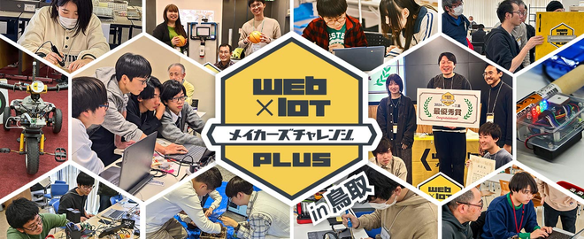
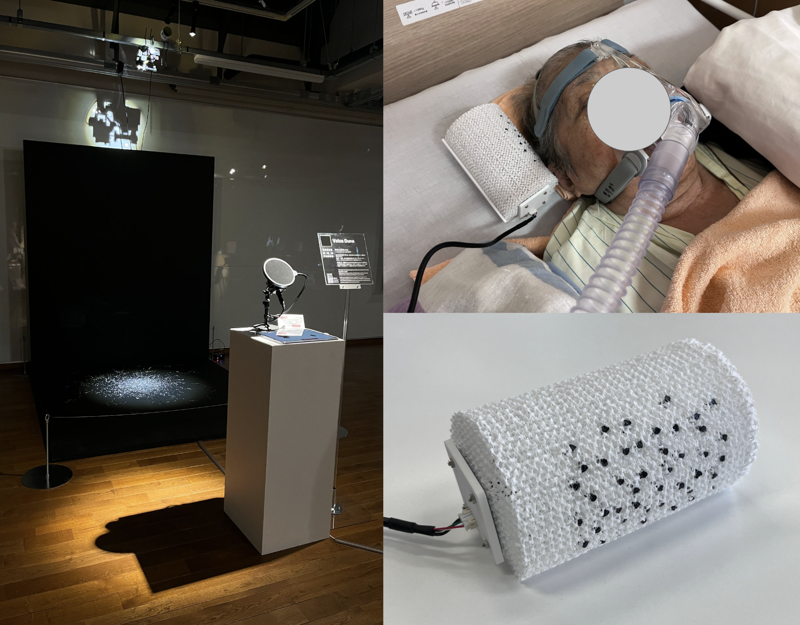
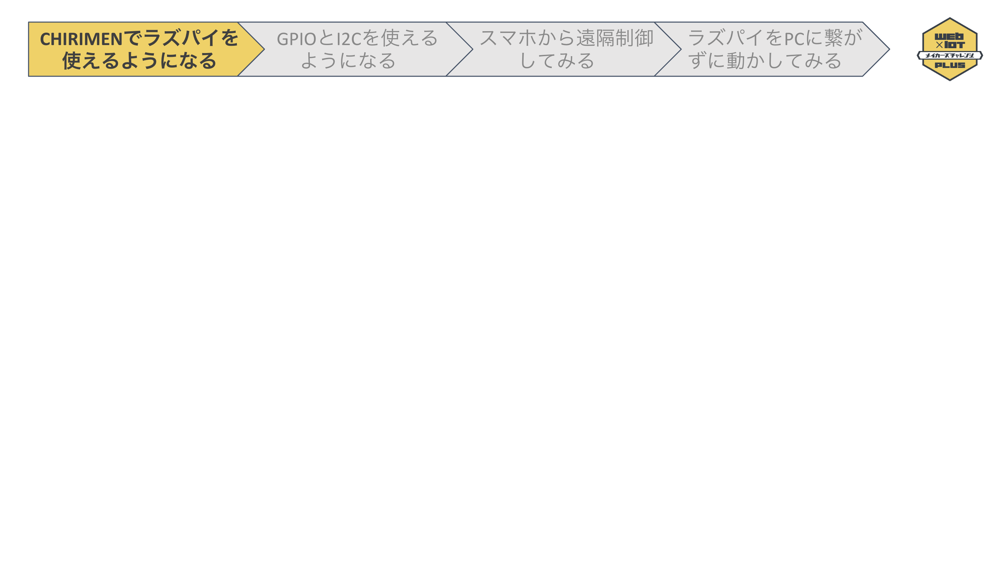

# ハンズオン講習
## DAY1 - Raspberry Pi Zero版 CHIRIMEN (基礎編)

---
<!--
_class: clean
_paginate: false




---

-->

## 講師の自己紹介
<div class="col-2">

<div>

- WebDINO Japan ワークショップファシリテータ
- 東京大学大学院 修士1年
- 情報工学とアートの融合分野について勉強中
- フラッグフットボーラー

</div>

<div>

 

</div>

</div>

---

## 本日の流れ
- CHIRIMENでラズパイを使えるようになる
ー休憩ー
- GPIOとI2Cを使えるようになる
ー休憩ー
- スマホから遠隔制御してみる
- ラズパイをPCに繋がずに動かしてみる（常駐プログラム化）

---

<!--
_class: pad
-->

## CHIRIMENとは


JavaScriptでセンサやモータなどのハードウェアデバイスを制御できるようにしたプロとタイピング環境。
<b>→Webとハードウェアを簡単に連携させることができる！</b>

---


## CHIRIMENチュートリアルを開く

Chromeなどのブラウザで[https://chirimen.org/pizero/](https://chirimen.org/pizero/)にアクセスする

もしくは

「chirimen pizero」などで検索🔍

---

## 本日使う機材の確認
<div class="col-2">

<div>

- WiFiに繋がったPC
- Raspberry Pi Zero 2WH
    - ケーブル
    - 赤いケース
- スターターキット
- microSDカード
</div>

<div>


</div>

</div>

<div class="link-box">

[👉 2.1 ステップ0（物品準備、PCをWiFiに接続）](https://chirimen.org/pizero/chapter_2-1)

</div>

---

## Raspberry Pi Zeroを起動させる
1. microSDカードをRaspberry Pi Zeroに差し込む
2. Raspberry Pi Zeroを赤いケースに入れる
3. PCの USB と Raspberry Pi Zero の USB OTGポートを USBケーブルで繋ぐ
<b>（ポートの位置に注意！）</b>


<div class="link-box">

[👉 2.2 ステップ1（ターミナル接続）](https://chirimen.org/pizero/chapter_2-2)

</div>

---

## ターミナルに接続する

1. [ターミナル](https://www.chirimen.org/PiZeroWebSerialConsole/PiZeroWebSerialConsole.html)にアクセスする
2. [Connect and Login PiZero]をクリックする
3. ポートを選択する


4. コンソールに```pi@raspberrypi:~$```と表示されるまで待つ


<div class="link-box">

[👉 2.2 ステップ1（ターミナル接続）](https://chirimen.org/pizero/chapter_2-2)

</div>

---

## WiFiの設定

1. [wifi panel] > [SSID] [PASS PHRASE] を入力
2. [SET WiFi] を選択
3. [Reboot] を選択
4. (もう一度) ターミナルにアクセス
5. [Connect and Login PiZero] を選択
    - シリアルポートが表示されていれば OK ✅
    - 起動完了まで約 2 分間かかります
8. [接続]

<div class="link-box">

[👉 2.3 ステップ2 (WiFi設定)](https://chirimen.org/pizero/chapter_2-3)

</div>

---

## まずはLチカ！
<div class="col-2">
<div>

＜用意するもの＞
- ブレッドボード
- ジャンパーワイヤー（オスーメス）　×2
- LED　×1
- 1kΩ抵抗（茶黒赤金）　×1

</div>

<div>


</div>

</div>

<div class="link-box">

[👉 3. Hello Real World（Lチカを実行する）](https://chirimen.org/pizero/chapter_3)

</div>

---

## ブレッドボードでの配線


<div class="link-box">

[👉 3.1 配線](https://chirimen.org/pizero/chapter_3-1)

</div>

---

## プログラムを書く

[myApp] > [移動] > [Create New Text] > "hello.js" と入力 > コピー&ペースト > [Save]
```javascript
import { requestGPIOAccess } from "node-web-gpio"; // WebGPIO を使えるようにするためのライブラリをインポート
const sleep = (msec) => new Promise((resolve) => setTimeout(resolve, msec)); // sleep 関数を定義

async function blink() {
  const gpioAccess = await requestGPIOAccess(); // GPIO を操作する
  const port = gpioAccess.ports.get(26); // 26 番ポートを操作する

  await port.export("out"); // ポートを出力モードに設定

  // 無限ループ
  for (;;) {
    // 1秒間隔で LED が点滅します
    await port.write(1); // LEDを点灯
    await sleep(1000); // 1000 ms (1秒) 待機
    await port.write(0); // LEDを消灯
    await sleep(1000); // 1000 ms (1秒) 待機
  }
}

blink();
```

---

## プログラムを実行する

- "hello.js" を実行する方法
→```node hello.js```とコンソールに入力しEnter

<br>

- 停止する方法
→コンソール上で```Ctrl```+```C```

<div class="link-box">

[👉 3.3 実行する](https://chirimen.org/pizero/chapter_3-3)

</div>

---

## サンプルコードのダウンロード
CHIRIMEN panel > Get Examples > hello-real-world (L チカ) > JS GET

他のサンプルコードや配線図を参照することができます


---

# ここまでのまとめ


- Raspberry Pi Zeroをセットアップした
- chirimenの基本的な使い方を学んだ
- LEDの制御方法を学んだ

<br>
これで皆さんもIoT開発者！👩‍💻

---

# チュートリアルでの実践

1. GPIOとI2Cを使えるようになる
2. スマホから遠隔制御してみる
3. ラズパイをPCに繋がずに動かしてみる（常駐プログラム化）
<br>

<b>＜チュートリアルのアクセス方法＞</b>
Chromeなどのブラウザで[https://chirimen.org/pizero/](https://chirimen.org/pizero/)にアクセスする

もしくは

「chirimen pizero」などで検索🔍

---

<!--
_class: pad
-->

## 本日の流れ

10:00 - 11:20　ハンズオン講習 - Raspberry Pi Zero版 CHIRIMEN（応用編）

11:20 - 12:00　ハンズオン機材の片付け・チーム分け発表！＋アイスブレイク

12:00 - 13:00　昼食休憩

13:00 - 14:20　ハッカソンに向けてのアイデアワークショップ


14:30 - 16:20　ハッカソンに向けてのチーム相談タイム

16:20 - 16:40　各チームの進捗発表タイム

16:40 - 17:00　ハッカソンについての説明、機材貸し出し、記念写真撮影

17:00　講習会DAY2 終了

---
# ハンズオン講習 
## DAY2 - Raspberry Pi Zero版 CHIRIMEN (応用編)
---

## いろいろなデバイスを自由に試してみよう！
自由に進めてもらって OK 👌


---

## ⚠️片付け注意事項

- 借りたセンサーをすべて返却します
- Raspberry Pi の電源を切ります
- microSD カードは必ず抜き取り、CHIRIMEN スターターキットを片付けます
- クリアボックスを片付けます
- できるだけ元の状態に戻してください
(詳しくは会場のスタッフが案内します)
