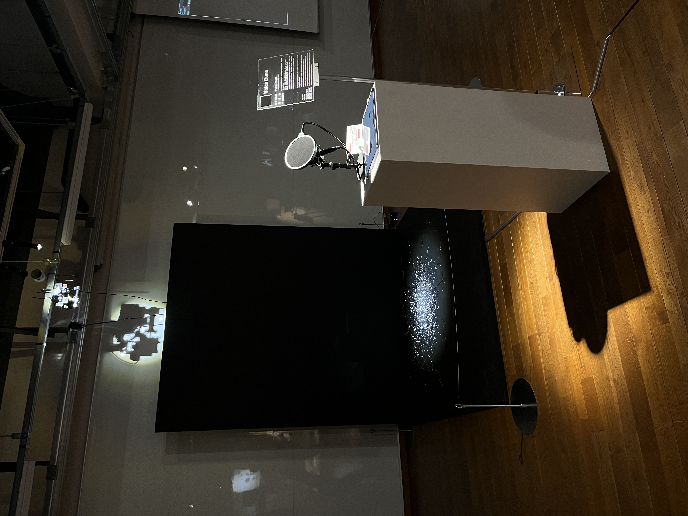

# ハンズオン講習
## Raspberry Pi Zero版 CHIRIMEN (基礎編)

---
<!--
_class: clean
_paginate: false
-->


---

## 講師の自己紹介
<div class="col-2">

<div>

- WebDINO Japan ワークショップファシリテータ
- 東京大学大学院 修士1年
- 情報工学とアートの融合分野について勉強中
- フラッグフットボーラー

</div>

<div>

 

</div>

</div>

---

## 本日の流れ
- CHIRIMENでラズパイを使えるようになる
- GPIOとI2Cを使えるようになる
- スマホから遠隔制御してみる
- ラズパイをPCに繋がずに動かしてみる（常駐プログラム化）

---

<!--
_class: pad
-->

## CHIRIMENとは


JavaScriptでセンサやモータなどのハードウェアデバイスを制御できるようにしたプロとタイピング環境。
<b>→Webとハードウェアを簡単に連携させることができる！</b>

---


## CHIRIMENチュートリアルを開く

Chromeなどのブラウザで[https://chirimen.org/pizero/](https://chirimen.org/pizero/)にアクセスする

もしくは

「chirimen pizero」などで検索🔍

---

## 本日使う機材の確認
<div class="col-2">

<div>

- WiFiに繋がったPC
- Raspberry Pi Zero 2WH
    - ケーブル
    - 赤いケース
- スターターキット
- microSDカード
</div>

<div>


</div>

</div>

<div class="link-box">

[👉 2.1 ステップ0（物品準備、PCをWiFiに接続）](https://chirimen.org/pizero/chapter_2-1)

</div>

---

## Raspberry Pi Zeroを起動させる
1. microSDカードをRaspberry Pi Zeroに差し込む
2. PCの USB と Raspberry Pi Zero の USB OTGポートを USBケーブルで繋ぐ
<b>（ポートの位置に注意！）</b>


<div class="link-box">

[👉 2.2 ステップ1（ターミナル接続）](https://chirimen.org/pizero/chapter_2-2)

</div>

---

## ターミナルに接続する

1. [ターミナル](https://www.chirimen.org/PiZeroWebSerialConsole/PiZeroWebSerialConsole.html)にアクセスする
2. [Connect and Login PiZero]をクリックする
3. ポートを選択する


4. コンソールに```pi@raspberrypi:~$```と表示されるまで待つ


<div class="link-box">

[👉 2.2 ステップ1（ターミナル接続）](https://chirimen.org/pizero/chapter_2-2)

</div>

---

## WiFiの設定


---

# まとめ

ご清聴ありがとうございました。